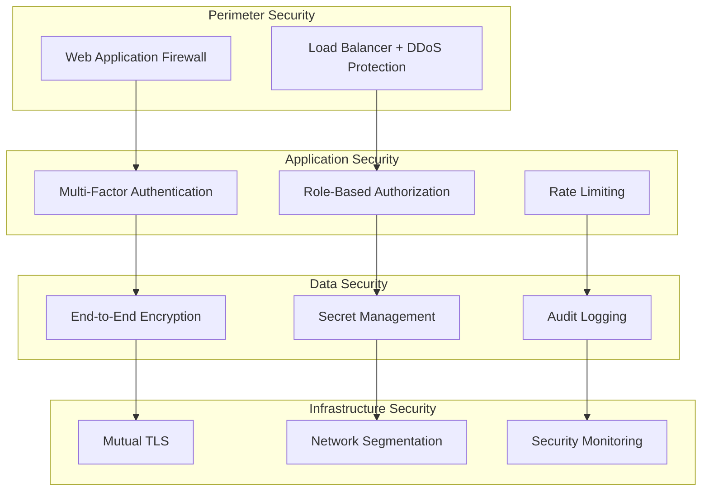

# 🔒 Enterprise-Sicherheit

Keiko Personal Assistant implementiert umfassende Sicherheitsmaßnahmen für Enterprise-Umgebungen mit mehrschichtigen Schutzkonzepten.

## 🛡️ Sicherheitsarchitektur

### Mehrschichtige Sicherheit



## 🔐 Authentifizierung & Autorisierung

### Multi-Faktor-Authentifizierung (MFA)

#### Unterstützte Faktoren

| Faktor | Typ | Beschreibung | Sicherheitslevel |
|--------|-----|--------------|------------------|
| **Passwort** | Wissen | Starke Passwort-Richtlinien | Basis |
| **TOTP** | Besitz | Time-based One-Time Password | Hoch |
| **Hardware-Token** | Besitz | FIDO2/WebAuthn | Sehr hoch |
| **Biometrie** | Eigenschaft | Fingerabdruck/Gesichtserkennung | Hoch |

#### MFA-Konfiguration

```python
# MFA-Einstellungen
MFA_SETTINGS = {
    "required": True,
    "methods": ["totp", "hardware_token"],
    "backup_codes": True,
    "session_timeout": 3600,  # 1 Stunde
    "remember_device": False
}
```

### Role-Based Access Control (RBAC)

#### Vordefinierte Rollen

```yaml
roles:
  admin:
    permissions:
      - "system:*"
      - "agents:*"
      - "users:*"
    description: "Vollzugriff auf alle Systemfunktionen"

  operator:
    permissions:
      - "agents:read"
      - "agents:execute"
      - "tasks:*"
    description: "Agent-Verwaltung und Task-Ausführung"

  viewer:
    permissions:
      - "agents:read"
      - "tasks:read"
      - "metrics:read"
    description: "Nur-Lese-Zugriff auf System-Informationen"

  api_user:
    permissions:
      - "api:execute"
      - "tasks:create"
    description: "Programmatischer API-Zugriff"
```

#### Berechtigungsprüfung

```python
from keiko.security import require_permission

@require_permission("agents:execute")
async def execute_agent_task(agent_id: str, task: dict):
    """Führt eine Agent-Task aus (erfordert agents:execute Berechtigung)."""
    # Implementation
    pass
```

## 🔑 Kryptographie & Verschlüsselung

### Verschlüsselungsstandards

| Komponente | Algorithmus | Schlüssellänge | Verwendung |
|------------|-------------|----------------|------------|
| **Datenübertragung** | TLS 1.3 | 256-bit | HTTPS/WSS |
| **Daten-at-Rest** | AES-256-GCM | 256-bit | Datenbank/Storage |
| **JWT-Signierung** | RS256 | 2048-bit | Token-Authentifizierung |
| **Passwort-Hashing** | Argon2id | - | Benutzer-Passwörter |

### Schlüsselverwaltung

#### Azure Key Vault Integration

```python
from keiko.security import KeyVaultManager

# Schlüssel-Manager initialisieren
key_manager = KeyVaultManager(
    vault_url="https://keiko-vault.vault.azure.net/",
    credential=DefaultAzureCredential()
)

# Verschlüsselungsschlüssel abrufen
encryption_key = await key_manager.get_secret("data-encryption-key")

# Automatische Schlüsselrotation
await key_manager.rotate_key("data-encryption-key", schedule="monthly")
```

#### Schlüsselrotation

```yaml
key_rotation:
  schedule: "0 2 1 * *"  # Monatlich um 2:00 Uhr
  keys:
    - name: "jwt-signing-key"
      type: "rsa"
      size: 2048
      retention_period: "90d"
    - name: "data-encryption-key"
      type: "aes"
      size: 256
      retention_period: "30d"
```

## 🌐 Netzwerksicherheit

### Mutual TLS (mTLS)

#### Client-Zertifikat-Authentifizierung

```python
# mTLS-Konfiguration
MTLS_CONFIG = {
    "enabled": True,
    "ca_cert_path": "/etc/ssl/certs/ca.pem",
    "server_cert_path": "/etc/ssl/certs/server.pem",
    "server_key_path": "/etc/ssl/private/server.key",
    "client_cert_required": True,
    "verify_mode": "CERT_REQUIRED"
}
```

#### Zertifikatsverwaltung

```bash
# Neues Client-Zertifikat erstellen
openssl genrsa -out client.key 2048
openssl req -new -key client.key -out client.csr
openssl x509 -req -in client.csr -CA ca.pem -CAkey ca.key -out client.pem

# Zertifikat validieren
openssl verify -CAfile ca.pem client.pem
```

### Netzwerk-Segmentierung

```yaml
network_policies:
  api_tier:
    ingress:
      - from: "load_balancer"
        ports: [443]
    egress:
      - to: "service_tier"
        ports: [8080]

  service_tier:
    ingress:
      - from: "api_tier"
        ports: [8080]
    egress:
      - to: "data_tier"
        ports: [5432, 6379]

  data_tier:
    ingress:
      - from: "service_tier"
        ports: [5432, 6379]
    egress: []  # Keine ausgehenden Verbindungen
```

## 📊 Security Monitoring

### Sicherheitsereignisse

#### Event-Kategorien

| Kategorie | Ereignisse | Schweregrad | Aktion |
|-----------|------------|-------------|--------|
| **Authentifizierung** | Login-Versuche, MFA-Fehler | INFO/WARN | Logging |
| **Autorisierung** | Zugriffsverweigerung | WARN | Alert |
| **Anomalien** | Ungewöhnliche API-Nutzung | WARN | Investigation |
| **Angriffe** | SQL-Injection, XSS | CRITICAL | Block + Alert |

#### Security Information and Event Management (SIEM)

```python
from keiko.security import SecurityEventLogger

# Sicherheitsereignis protokollieren
security_logger = SecurityEventLogger()

await security_logger.log_event(
    event_type="authentication_failure",
    severity="WARNING",
    user_id="user123",
    ip_address="192.168.1.100",
    details={
        "reason": "invalid_password",
        "attempts": 3,
        "user_agent": "Mozilla/5.0..."
    }
)
```

### Intrusion Detection

#### Anomalie-Erkennung

```python
# Anomalie-Erkennungsregeln
ANOMALY_RULES = {
    "failed_login_threshold": {
        "count": 5,
        "window": "5m",
        "action": "block_ip"
    },
    "api_rate_anomaly": {
        "threshold": "3x_baseline",
        "window": "1h",
        "action": "alert"
    },
    "privilege_escalation": {
        "pattern": "role_change",
        "action": "immediate_alert"
    }
}
```

## 🔍 Compliance & Audit

### Audit-Logging

#### Audit-Ereignisse

```python
from keiko.audit import AuditLogger

audit_logger = AuditLogger()

# Kritische Aktion protokollieren
await audit_logger.log_action(
    action="agent_task_execution",
    user_id="user123",
    resource_id="agent_456",
    details={
        "task_type": "data_processing",
        "data_classification": "confidential",
        "approval_required": True,
        "approver": "manager789"
    }
)
```

#### Compliance-Standards

| Standard | Abdeckung | Status | Zertifizierung |
|----------|-----------|--------|----------------|
| **ISO 27001** | Informationssicherheit | ✅ Implementiert | Geplant |
| **SOC 2 Type II** | Service-Sicherheit | ✅ Implementiert | In Arbeit |
| **GDPR** | Datenschutz | ✅ Implementiert | Konform |
| **HIPAA** | Gesundheitsdaten | 🔄 In Entwicklung | Geplant |

### Datenschutz

#### Datenklassifizierung

```python
from keiko.security import DataClassifier

# Daten klassifizieren
classifier = DataClassifier()

classification = await classifier.classify_data(
    data=user_input,
    context="agent_task"
)

# Basierend auf Klassifizierung handeln
if classification.level == "confidential":
    await apply_enhanced_encryption(data)
    await log_confidential_access(user_id, data_id)
```

## 🚨 Incident Response

### Sicherheitsvorfälle

#### Incident-Kategorien

| Kategorie | Beispiele | Response-Zeit | Eskalation |
|-----------|-----------|---------------|------------|
| **P1 - Kritisch** | Datenleck, System-Kompromittierung | < 15 Min | CISO |
| **P2 - Hoch** | Authentifizierungs-Bypass | < 1 Std | Security Team |
| **P3 - Mittel** | Anomale API-Nutzung | < 4 Std | Operations |
| **P4 - Niedrig** | Policy-Verletzung | < 24 Std | Team Lead |

#### Automatisierte Response

```python
from keiko.security import IncidentResponse

# Incident-Response-System
incident_response = IncidentResponse()

# Automatische Reaktion auf Sicherheitsereignis
@incident_response.handler("authentication_attack")
async def handle_auth_attack(event):
    # IP-Adresse blockieren
    await firewall.block_ip(event.source_ip)

    # Benutzer benachrichtigen
    await notify_security_team(event)

    # Forensische Daten sammeln
    await collect_forensic_data(event)
```

## 📋 Security Checklist

### Deployment-Sicherheit

- [ ] **TLS 1.3** für alle externen Verbindungen aktiviert
- [ ] **mTLS** für interne Service-Kommunikation konfiguriert
- [ ] **Starke Passwort-Richtlinien** implementiert
- [ ] **MFA** für alle privilegierten Accounts aktiviert
- [ ] **RBAC** korrekt konfiguriert und getestet
- [ ] **Audit-Logging** für alle kritischen Aktionen aktiviert
- [ ] **Security Monitoring** und Alerting eingerichtet
- [ ] **Vulnerability Scanning** regelmäßig durchgeführt
- [ ] **Penetration Testing** jährlich durchgeführt
- [ ] **Incident Response Plan** dokumentiert und getestet

### Laufende Sicherheit

- [ ] **Sicherheits-Updates** regelmäßig eingespielt
- [ ] **Schlüsselrotation** nach Plan durchgeführt
- [ ] **Access Reviews** quartalsweise durchgeführt
- [ ] **Security Metrics** überwacht
- [ ] **Compliance-Audits** bestanden
- [ ] **Mitarbeiter-Schulungen** durchgeführt

!!! warning "Sicherheitshinweis"
    Diese Dokumentation enthält allgemeine Sicherheitsrichtlinien. Für produktive Umgebungen sollten zusätzliche, umgebungsspezifische Sicherheitsmaßnahmen implementiert werden.

!!! info "Weitere Informationen"
    Detaillierte Sicherheitskonfigurationen finden Sie in der [Monitoring-Dokumentation](monitoring.md) und [Input-Validation-Dokumentation](input-validation.md).
