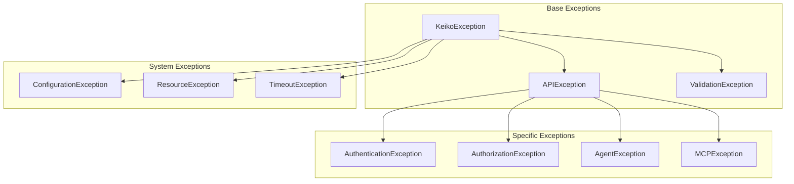

# ⚠️ Exceptions API

Umfassende Exception-Behandlung für robuste und benutzerfreundliche Fehlerbehandlung.

## 🏗️ Exception-Hierarchie



## 🎯 Exception-Klassen

### Basis-Exception-Klassen

```python
from typing import Optional, Dict, Any
import traceback
from enum import Enum

class ErrorCode(Enum):
    """Standardisierte Error-Codes."""

    # Authentication & Authorization
    INVALID_CREDENTIALS = "AUTH_001"
    TOKEN_EXPIRED = "AUTH_002"
    INSUFFICIENT_PERMISSIONS = "AUTH_003"

    # Validation
    INVALID_INPUT = "VAL_001"
    MISSING_REQUIRED_FIELD = "VAL_002"
    INVALID_FORMAT = "VAL_003"

    # Agent Errors
    AGENT_NOT_FOUND = "AGENT_001"
    AGENT_UNAVAILABLE = "AGENT_002"
    TASK_EXECUTION_FAILED = "AGENT_003"

    # MCP Errors
    MCP_SERVER_UNREACHABLE = "MCP_001"
    MCP_TOOL_NOT_FOUND = "MCP_002"
    MCP_EXECUTION_FAILED = "MCP_003"

    # System Errors
    CONFIGURATION_ERROR = "SYS_001"
    RESOURCE_EXHAUSTED = "SYS_002"
    TIMEOUT_ERROR = "SYS_003"
    INTERNAL_ERROR = "SYS_999"

class KeikoException(Exception):
    """Basis-Exception für alle Keiko-spezifischen Fehler."""

    def __init__(
        self,
        message: str,
        error_code: ErrorCode,
        details: Optional[Dict[str, Any]] = None,
        cause: Optional[Exception] = None
    ):
        super().__init__(message)
        self.message = message
        self.error_code = error_code
        self.details = details or {}
        self.cause = cause
        self.traceback_info = traceback.format_exc() if cause else None

    def to_dict(self) -> Dict[str, Any]:
        """Konvertiert Exception zu Dictionary."""
        return {
            "error_type": self.__class__.__name__,
            "error_code": self.error_code.value,
            "message": self.message,
            "details": self.details,
            "cause": str(self.cause) if self.cause else None
        }

    def __str__(self) -> str:
        return f"[{self.error_code.value}] {self.message}"

class APIException(KeikoException):
    """Exception für API-spezifische Fehler."""

    def __init__(
        self,
        message: str,
        error_code: ErrorCode,
        status_code: int = 500,
        details: Optional[Dict[str, Any]] = None,
        cause: Optional[Exception] = None
    ):
        super().__init__(message, error_code, details, cause)
        self.status_code = status_code

    def to_dict(self) -> Dict[str, Any]:
        result = super().to_dict()
        result["status_code"] = self.status_code
        return result

class ValidationException(KeikoException):
    """Exception für Validation-Fehler."""

    def __init__(
        self,
        message: str,
        field: Optional[str] = None,
        invalid_value: Optional[Any] = None,
        details: Optional[Dict[str, Any]] = None
    ):
        super().__init__(
            message,
            ErrorCode.INVALID_INPUT,
            details
        )
        self.field = field
        self.invalid_value = invalid_value

    def to_dict(self) -> Dict[str, Any]:
        result = super().to_dict()
        result.update({
            "field": self.field,
            "invalid_value": str(self.invalid_value) if self.invalid_value else None
        })
        return result
```

### Spezifische Exception-Klassen

```python
class AuthenticationException(APIException):
    """Exception für Authentifizierungs-Fehler."""

    def __init__(
        self,
        message: str = "Authentication failed",
        error_code: ErrorCode = ErrorCode.INVALID_CREDENTIALS,
        details: Optional[Dict[str, Any]] = None
    ):
        super().__init__(message, error_code, 401, details)

class AuthorizationException(APIException):
    """Exception für Autorisierungs-Fehler."""

    def __init__(
        self,
        message: str = "Insufficient permissions",
        required_permission: Optional[str] = None,
        details: Optional[Dict[str, Any]] = None
    ):
        details = details or {}
        if required_permission:
            details["required_permission"] = required_permission

        super().__init__(
            message,
            ErrorCode.INSUFFICIENT_PERMISSIONS,
            403,
            details
        )

class AgentException(KeikoException):
    """Exception für Agent-spezifische Fehler."""

    def __init__(
        self,
        message: str,
        agent_id: Optional[str] = None,
        task_id: Optional[str] = None,
        error_code: ErrorCode = ErrorCode.TASK_EXECUTION_FAILED,
        details: Optional[Dict[str, Any]] = None
    ):
        details = details or {}
        if agent_id:
            details["agent_id"] = agent_id
        if task_id:
            details["task_id"] = task_id

        super().__init__(message, error_code, details)

class MCPException(KeikoException):
    """Exception für MCP-spezifische Fehler."""

    def __init__(
        self,
        message: str,
        server_name: Optional[str] = None,
        tool_name: Optional[str] = None,
        error_code: ErrorCode = ErrorCode.MCP_EXECUTION_FAILED,
        details: Optional[Dict[str, Any]] = None
    ):
        details = details or {}
        if server_name:
            details["server_name"] = server_name
        if tool_name:
            details["tool_name"] = tool_name

        super().__init__(message, error_code, details)

class TimeoutException(KeikoException):
    """Exception für Timeout-Fehler."""

    def __init__(
        self,
        message: str = "Operation timed out",
        timeout_seconds: Optional[float] = None,
        operation: Optional[str] = None,
        details: Optional[Dict[str, Any]] = None
    ):
        details = details or {}
        if timeout_seconds:
            details["timeout_seconds"] = timeout_seconds
        if operation:
            details["operation"] = operation

        super().__init__(message, ErrorCode.TIMEOUT_ERROR, details)

class ResourceException(KeikoException):
    """Exception für Resource-Fehler."""

    def __init__(
        self,
        message: str,
        resource_type: Optional[str] = None,
        resource_id: Optional[str] = None,
        details: Optional[Dict[str, Any]] = None
    ):
        details = details or {}
        if resource_type:
            details["resource_type"] = resource_type
        if resource_id:
            details["resource_id"] = resource_id

        super().__init__(message, ErrorCode.RESOURCE_EXHAUSTED, details)
```

## 🔧 Exception-Handler

### FastAPI Exception-Handler

```python
from fastapi import FastAPI, Request, HTTPException
from fastapi.responses import JSONResponse
from fastapi.exceptions import RequestValidationError
import logging

app = FastAPI()
logger = logging.getLogger(__name__)

@app.exception_handler(KeikoException)
async def keiko_exception_handler(request: Request, exc: KeikoException):
    """Handler für Keiko-spezifische Exceptions."""

    # Exception protokollieren
    logger.error(
        f"KeikoException: {exc}",
        extra={
            "error_code": exc.error_code.value,
            "details": exc.details,
            "path": request.url.path,
            "method": request.method
        }
    )

    # Status-Code bestimmen
    status_code = 500
    if isinstance(exc, APIException):
        status_code = exc.status_code
    elif isinstance(exc, ValidationException):
        status_code = 422
    elif isinstance(exc, AuthenticationException):
        status_code = 401
    elif isinstance(exc, AuthorizationException):
        status_code = 403

    return JSONResponse(
        status_code=status_code,
        content={
            "error": exc.to_dict(),
            "request_id": getattr(request.state, "correlation_id", None),
            "timestamp": time.time()
        }
    )

@app.exception_handler(RequestValidationError)
async def validation_exception_handler(request: Request, exc: RequestValidationError):
    """Handler für Pydantic-Validation-Errors."""

    errors = []
    for error in exc.errors():
        field = ".".join(str(loc) for loc in error["loc"])
        validation_exc = ValidationException(
            message=error["msg"],
            field=field,
            invalid_value=error.get("input")
        )
        errors.append(validation_exc.to_dict())

    return JSONResponse(
        status_code=422,
        content={
            "error": {
                "error_type": "ValidationError",
                "error_code": "VAL_001",
                "message": "Input validation failed",
                "validation_errors": errors
            },
            "request_id": getattr(request.state, "correlation_id", None),
            "timestamp": time.time()
        }
    )

@app.exception_handler(HTTPException)
async def http_exception_handler(request: Request, exc: HTTPException):
    """Handler für Standard-HTTP-Exceptions."""

    return JSONResponse(
        status_code=exc.status_code,
        content={
            "error": {
                "error_type": "HTTPException",
                "error_code": f"HTTP_{exc.status_code}",
                "message": exc.detail,
                "status_code": exc.status_code
            },
            "request_id": getattr(request.state, "correlation_id", None),
            "timestamp": time.time()
        }
    )

@app.exception_handler(Exception)
async def general_exception_handler(request: Request, exc: Exception):
    """Handler für unbehandelte Exceptions."""

    # Unerwartete Fehler protokollieren
    logger.exception(
        f"Unhandled exception: {exc}",
        extra={
            "path": request.url.path,
            "method": request.method,
            "exception_type": type(exc).__name__
        }
    )

    return JSONResponse(
        status_code=500,
        content={
            "error": {
                "error_type": "InternalServerError",
                "error_code": "SYS_999",
                "message": "An internal server error occurred",
                "details": {"exception_type": type(exc).__name__}
            },
            "request_id": getattr(request.state, "correlation_id", None),
            "timestamp": time.time()
        }
    )
```

## 🔍 Exception-Utilities

### Exception-Helper-Funktionen

```python
import functools
import asyncio
from typing import Callable, Type, Union, List

def handle_exceptions(
    exceptions: Union[Type[Exception], List[Type[Exception]]],
    default_message: str = "Operation failed",
    error_code: ErrorCode = ErrorCode.INTERNAL_ERROR
):
    """Decorator für Exception-Handling."""

    if not isinstance(exceptions, list):
        exceptions = [exceptions]

    def decorator(func: Callable):
        @functools.wraps(func)
        async def async_wrapper(*args, **kwargs):
            try:
                return await func(*args, **kwargs)
            except tuple(exceptions) as e:
                raise KeikoException(
                    message=f"{default_message}: {str(e)}",
                    error_code=error_code,
                    cause=e
                )

        @functools.wraps(func)
        def sync_wrapper(*args, **kwargs):
            try:
                return func(*args, **kwargs)
            except tuple(exceptions) as e:
                raise KeikoException(
                    message=f"{default_message}: {str(e)}",
                    error_code=error_code,
                    cause=e
                )

        return async_wrapper if asyncio.iscoroutinefunction(func) else sync_wrapper

    return decorator

def timeout_handler(timeout_seconds: float, operation_name: str = "Operation"):
    """Decorator für Timeout-Handling."""

    def decorator(func: Callable):
        @functools.wraps(func)
        async def wrapper(*args, **kwargs):
            try:
                return await asyncio.wait_for(
                    func(*args, **kwargs),
                    timeout=timeout_seconds
                )
            except asyncio.TimeoutError:
                raise TimeoutException(
                    message=f"{operation_name} timed out after {timeout_seconds} seconds",
                    timeout_seconds=timeout_seconds,
                    operation=operation_name
                )

        return wrapper
    return decorator

def retry_on_exception(
    exceptions: Union[Type[Exception], List[Type[Exception]]],
    max_retries: int = 3,
    delay: float = 1.0,
    backoff_factor: float = 2.0
):
    """Decorator für Retry-Logic bei Exceptions."""

    if not isinstance(exceptions, list):
        exceptions = [exceptions]

    def decorator(func: Callable):
        @functools.wraps(func)
        async def wrapper(*args, **kwargs):
            last_exception = None

            for attempt in range(max_retries + 1):
                try:
                    return await func(*args, **kwargs)
                except tuple(exceptions) as e:
                    last_exception = e

                    if attempt < max_retries:
                        wait_time = delay * (backoff_factor ** attempt)
                        await asyncio.sleep(wait_time)
                        continue

                    # Alle Versuche fehlgeschlagen
                    raise KeikoException(
                        message=f"Operation failed after {max_retries + 1} attempts",
                        error_code=ErrorCode.INTERNAL_ERROR,
                        details={
                            "max_retries": max_retries,
                            "last_error": str(last_exception)
                        },
                        cause=last_exception
                    )

            return None  # Sollte nie erreicht werden

        return wrapper
    return decorator

# Verwendungsbeispiele
@handle_exceptions([ConnectionError, TimeoutError], "Database connection failed")
@timeout_handler(30.0, "Database query")
async def query_database(query: str):
    """Beispiel für Exception-Handling."""
    # Database-Query-Implementation
    pass

@retry_on_exception([MCPException], max_retries=3, delay=1.0)
async def execute_mcp_tool(server_name: str, tool_name: str, arguments: dict):
    """Beispiel für Retry-Logic."""
    # MCP-Tool-Execution-Implementation
    pass
```

## 📊 Exception-Monitoring

### Exception-Metriken

```python
from prometheus_client import Counter, Histogram

# Exception-Metriken
EXCEPTIONS_TOTAL = Counter(
    'keiko_exceptions_total',
    'Gesamtanzahl der Exceptions',
    ['exception_type', 'error_code', 'component']
)

EXCEPTION_HANDLING_TIME = Histogram(
    'keiko_exception_handling_seconds',
    'Zeit für Exception-Handling',
    ['exception_type'],
    buckets=[0.001, 0.005, 0.01, 0.025, 0.05, 0.1]
)

def monitor_exceptions(component: str = "unknown"):
    """Decorator für Exception-Monitoring."""

    def decorator(func: Callable):
        @functools.wraps(func)
        async def wrapper(*args, **kwargs):
            start_time = time.time()

            try:
                return await func(*args, **kwargs)
            except KeikoException as e:
                EXCEPTIONS_TOTAL.labels(
                    exception_type=type(e).__name__,
                    error_code=e.error_code.value,
                    component=component
                ).inc()
                raise
            except Exception as e:
                EXCEPTIONS_TOTAL.labels(
                    exception_type=type(e).__name__,
                    error_code="UNKNOWN",
                    component=component
                ).inc()
                raise
            finally:
                duration = time.time() - start_time
                EXCEPTION_HANDLING_TIME.labels(
                    exception_type="success"
                ).observe(duration)

        return wrapper
    return decorator
```

## 📋 Exception-Best-Practices

### Exception-Handling-Guidelines

```python
class ExceptionBestPractices:
    """Best Practices für Exception-Handling."""

    @staticmethod
    def create_user_friendly_message(exc: KeikoException) -> str:
        """Erstellt benutzerfreundliche Fehlermeldung."""

        user_messages = {
            ErrorCode.INVALID_CREDENTIALS: "Benutzername oder Passwort ist falsch.",
            ErrorCode.TOKEN_EXPIRED: "Ihre Sitzung ist abgelaufen. Bitte melden Sie sich erneut an.",
            ErrorCode.INSUFFICIENT_PERMISSIONS: "Sie haben nicht die erforderlichen Berechtigungen.",
            ErrorCode.AGENT_NOT_FOUND: "Der angeforderte Agent wurde nicht gefunden.",
            ErrorCode.MCP_SERVER_UNREACHABLE: "Der externe Service ist momentan nicht verfügbar.",
            ErrorCode.TIMEOUT_ERROR: "Die Anfrage dauerte zu lange. Bitte versuchen Sie es erneut.",
            ErrorCode.RESOURCE_EXHAUSTED: "Das System ist momentan überlastet. Bitte versuchen Sie es später erneut."
        }

        return user_messages.get(
            exc.error_code,
            "Ein unerwarteter Fehler ist aufgetreten. Bitte kontaktieren Sie den Support."
        )

    @staticmethod
    def should_retry(exc: Exception) -> bool:
        """Bestimmt, ob ein Retry sinnvoll ist."""

        # Retry bei temporären Fehlern
        retry_exceptions = [
            TimeoutException,
            ResourceException
        ]

        # Kein Retry bei permanenten Fehlern
        no_retry_exceptions = [
            AuthenticationException,
            AuthorizationException,
            ValidationException
        ]

        if any(isinstance(exc, retry_exc) for retry_exc in retry_exceptions):
            return True

        if any(isinstance(exc, no_retry_exc) for no_retry_exc in no_retry_exceptions):
            return False

        # Bei MCP-Exceptions: nur bei Server-Fehlern retry
        if isinstance(exc, MCPException):
            return exc.error_code in [ErrorCode.MCP_SERVER_UNREACHABLE]

        return False

    @staticmethod
    def get_log_level(exc: Exception) -> str:
        """Bestimmt Log-Level für Exception."""

        if isinstance(exc, (AuthenticationException, ValidationException)):
            return "WARNING"

        if isinstance(exc, (AuthorizationException, AgentException)):
            return "ERROR"

        if isinstance(exc, (TimeoutException, ResourceException)):
            return "CRITICAL"

        return "ERROR"
```

!!! warning "Security-Hinweis"
    Geben Sie in Produktionsumgebungen keine detaillierten Fehlermeldungen an Endbenutzer weiter, die interne Systemdetails preisgeben könnten.

!!! tip "Monitoring-Integration"
    Nutzen Sie die Exception-Metriken für proaktives Monitoring und Alerting bei kritischen Fehlern.
